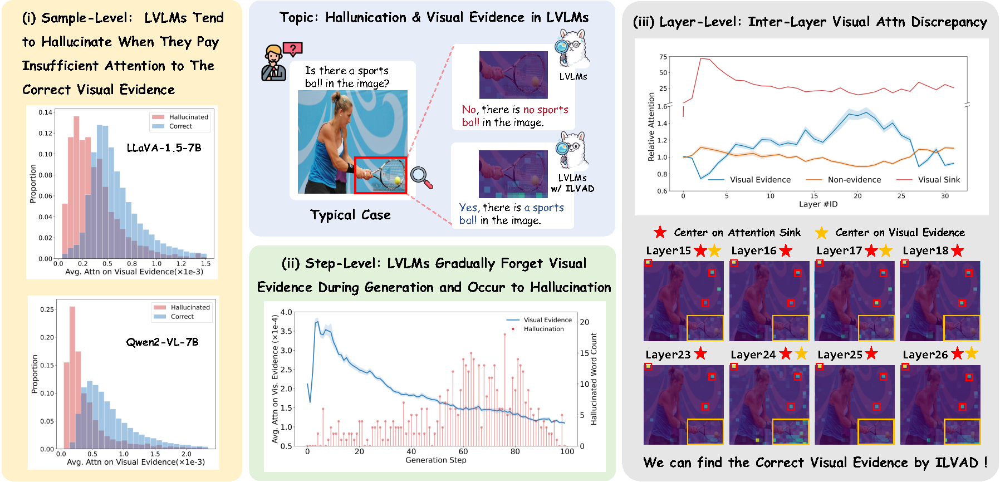
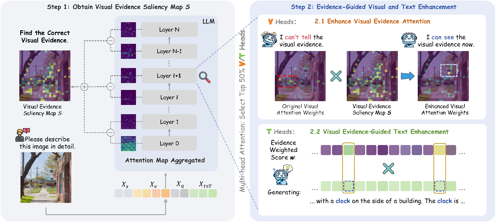

# Finding the Correct Visual Evidence Without Forgetting: Mitigating Hallucination in LVLMs via Inter-Layer Visual Attention Discrepancy

This is the official implementation of the paper **"Finding the Correct Visual Evidence Without Forgetting: Mitigating Hallucination in LVLMs via Inter-Layer Visual Attention Discrepancy"**, accepted by **ICML 2026**.

---

## Overview

Large Vision-Language Models (LVLMs) have shown remarkable performance on a wide range of vision-language tasks. Despite this progress, they are still prone to hallucination, generatingresponses that are inconsistent with visual content.


<p align="center">
  
</p>

In this work, we find that LVLMs tend to hallucinate when they pay insufficient attention to the correct visual evidence and gradually forget it during the generation process. We empirically find that although LVLMs overall attend insufficiently to visual evidence, they exhibit sensitivity to the correct visual evidence in specific layers, with notable inter-layer discrepancy.Motivated by this observation, we propose **Inter-Layer Visual Attention Discrepancy (ILVAD)**, a training-free hallucination mitigation method that enhances visual evidence during generation. 

<p align="center">
  
</p>

Specifically, ILVAD obtains the attention weights from early generated tokens to visual tokens across layers and identifies the visual tokens that are repeatedly activated as visual evidence, forming a saliency map. The saliency map is then used to enhance attention to visual evidence during generation. In addition, ILVAD leverages the saliency map to compute attention scores from generated text tokens to visual evidence, allowing the model to select and emphasize text tokens that are strongly grounded in the image.

---

## Installation

```bash
conda create -n ilvad python=3.10
conda activate ilvad
pip install -r requirements.txt
```

## Prepare Data and Models

### 1. Data

Download **MSCOCO**, **LLaVA-Bench (In-the-Wild)**, and other benchmarks. Organize the data under `./data` as follows:

```text
├── coco
│     ├── val2014
│     └── annotations
│           ├── captions_val2014.json
│           └── instances_val2014.json
├── pope
│     └── coco
│           ├── coco_pope_popular.json
│           ├── coco_pope_random.json
│           └── coco_pope_adversarial.json
└── llava-bench-in-the-wild
      ├── images
      └── questions.jsonl
```

### 2. Large Vision-Language Models

Download the LVLM checkpoints and update `model_dir` in the corresponding `.sh` scripts if needed, for example:
[LLaVA-1.5-7B](https://huggingface.co/llava-hf/llava-1.5-7b-hf), [LLaVA-NeXT-7B](https://huggingface.co/llava-hf/llava-v1.6-vicuna-7b-hf) and [Qwen3-VL-8B-Instruct](https://huggingface.co/Qwen/Qwen3-VL-8B-Instruct)

---

## Usage

Run inference with the provided scripts:

```bash
# Syntax
bash scripts/infer.sh <method> <benchmark>

# For POPE evaluation.
bash scripts/infer_llava1_5.sh ilvad pope
# For CHAIR evaluation.
bash scripts/infer_llava1_5.sh ilvad chair
# For LLaVA-Bench (In-the-Wild) evaluation.
bash scripts/infer_llava1_5.sh ilvad llava_wild
```

For GPT-4o evaluation on LLaVA-Bench (In-the-Wild):

```bash
python eval/llava_wild.py \
  --response1 <baseline.json> \
  --response2 <ilvad.json> \
  --api-key <api-key>
```

Please check the bash scripts for how to read the results.

---

## Citation

If you find this work useful for your research, please consider citing our paper:

```bibtex
@inproceedings{Xie-ilvad-icml2026,
  title     = {Finding the Correct Visual Evidence Without Forgetting: Mitigating Hallucination in LVLMs via Inter-Layer Visual Attention Discrepancy},
  author    = {Yutong Xie and 
               Zhenglin Hua and 
               Ran Wang and 
               Wing W. Y. Ng and 
               Xizhao Wang and 
               Yuheng Jia},
  booktitle = {Proceedings of the 43rd International Conference on Machine Learning},
  year      = {2026}
}
```

---

## Acknowledgements

Our codebase is adapted from [VHR](https://github.com/jinghan1he/VHR) and [SSL](https://github.com/huazhenglin2003/SSL). We thank the authors for releasing their code!

